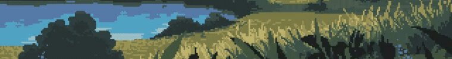

<p align="center">
  
</p>
<h1 align="center">Hi ❤️, I'm Kavya</h1>

<h3 align="center">Computer Science Engineering Student</h3>

<p align="center">

</p>
<p align="center">


</p>
 
 ## 👩‍💻 ABOUT ME

```java
class Lily {

    String role = "Computer Science Engineering Student";
    String focus = "Aspiring Software Engineer";

    String[] learning = {
        "Java",
        "Data Structures & Algorithms",
        "Full Stack Development",
        "Web Development",
        "AI Tools"
    };

    String[] interests = {
        "Building Real-World Projects",
        "Problem Solving",
        "Open Source",
        "Continuous Learning"
    };

    String goal = "Build software that creates real-world impact.";
}
```
  
</p>

## 💻 Tech Stack
 **Languages**

<p>
  
</p>

### 🌐 Frontend

<p>
  
</p>

### ⚙️ Backend

<p>
  
</p>

### 🗄️ Database

<p>
  
</p>

### 🛠️ Tools & Design

<p>
  
</p>

### 🤖 AI Tools

<p>
  ChatGPT • Claude AI • Groq API • Lovable • Manus AI
</p>

</p>
🔥 GitHub Streak

<p align="center">

</p>

## 🤝 Connect With Me

<p align="left">
  <a href="https://www.linkedin.com/in/kavya-sri-7a2a21351/" target="_blank">
    
  </a>
  <a href="https://x.com/Sihyunlily" target="_blank">
    
  </a>
  <a href="mailto:kavyaramavath13@gmail.com">
    
  </a>
  <a href="https://github.com/kavyaramavath13-hash" target="_blank">
    
  </a>
</p>
<div align="center">
  
    

  <b>Thanks for stopping by! Let's build something amazing together. 🚀</b>
</div>

